# Entity Relationship Diagram - PantyHub

> **Auto-generated** from your idea analysis
> **Entities:** 32

---

## Visual Diagram

```mermaid
erDiagram
    profiles {
        uuid id PK
        text username UK
        text display_name
        text avatar_url
        timestamptz created_at
        timestamptz updated_at
    }

    app_users {
        uuid id PK
        uuid user_id FK
        text username UK
        text email UK
        text password
        text role
        timestamptz created_at
        timestamptz updated_at
    }

    listings {
        uuid id PK
        uuid user_id FK
        text title
        text description
        int price
        text status
        timestamptz created_at
        timestamptz updated_at
    }

    reviews {
        uuid id PK
        uuid user_id FK
        int rating
        text feedback
        timestamptz created_at
        timestamptz updated_at
    }

    shops {
        uuid id PK
        uuid user_id FK
        text name
        text description
        timestamptz created_at
        timestamptz updated_at
    }

    orders {
        uuid id PK
        uuid user_id FK
        uuid listing_id FK
        uuid buyer_id FK
        uuid seller_id FK
        int amount
        text status
        text payment_intent_id FK
        timestamptz created_at
        timestamptz updated_at
    }

    payments {
        uuid id PK
        uuid user_id FK
        text stripe_payment_id UK,FK
        int amount
        text currency
        text status
        text payment_method
        text description
        timestamptz created_at
        timestamptz updated_at
    }

    subscriptions {
        uuid id PK
        uuid user_id FK
        text stripe_customer_id UK,FK
        text stripe_subscription_id UK,FK
        text plan_name
        int price_amount
        text interval
        text status
        timestamptz current_period_end
        timestamptz created_at
        timestamptz updated_at
    }

    uploads {
        uuid id PK
        uuid user_id FK
        text file_name
        text file_url
        text file_type
        int file_size
        text storage_path
        text alt_text
        timestamptz created_at
        timestamptz updated_at
    }

    channels {
        uuid id PK
        uuid user_id FK
        text name
        text type
        timestamptz created_at
        timestamptz updated_at
    }

    notifications {
        uuid id PK
        uuid user_id FK
        text title
        text message
        text type
        boolean read
        text action_url
        uuid sender_id FK
        timestamptz created_at
        timestamptz updated_at
    }

    conversations {
        uuid id PK
        uuid user_id FK
        text title
        boolean is_group
        timestamptz last_message_at
        timestamptz created_at
        timestamptz updated_at
    }

    messages {
        uuid id PK
        uuid user_id FK
        text content
        uuid conversation_id FK
        uuid sender_id FK
        text message_type
        timestamptz read_at
        timestamptz created_at
        timestamptz updated_at
    }

    global_search_features {
        uuid id PK
        uuid user_id FK
        text title
        text description
        text status
        jsonb metadata
        timestamptz created_at
        timestamptz updated_at
    }

    safe_transactions {
        uuid id PK
        uuid user_id FK
        text title
        text description
        text status
        jsonb metadata
        timestamptz created_at
        timestamptz updated_at
    }

    own_shop_systems {
        uuid id PK
        uuid user_id FK
        text title
        text description
        text status
        jsonb metadata
        timestamptz created_at
        timestamptz updated_at
    }

    set_your_own_prices {
        uuid id PK
        uuid user_id FK
        text title
        text description
        text status
        jsonb metadata
        timestamptz created_at
        timestamptz updated_at
    }

    no_transaction_fees {
        uuid id PK
        uuid user_id FK
        text title
        text description
        text status
        jsonb metadata
        timestamptz created_at
        timestamptz updated_at
    }

    messages_and_chat_systems {
        uuid id PK
        uuid user_id FK
        text title
        text description
        text status
        jsonb metadata
        timestamptz created_at
        timestamptz updated_at
    }

    classified_ad_markets {
        uuid id PK
        uuid user_id FK
        text title
        text description
        text status
        jsonb metadata
        timestamptz created_at
        timestamptz updated_at
    }

    member_reviews {
        uuid id PK
        uuid user_id FK
        text title
        text description
        text status
        jsonb metadata
        timestamptz created_at
        timestamptz updated_at
    }

    privacy_functions {
        uuid id PK
        uuid user_id FK
        text title
        text description
        text status
        jsonb metadata
        timestamptz created_at
        timestamptz updated_at
    }

    media_clouds {
        uuid id PK
        uuid user_id FK
        text title
        text description
        text status
        jsonb metadata
        timestamptz created_at
        timestamptz updated_at
    }

    user_blocking_systems {
        uuid id PK
        uuid user_id FK
        text title
        text description
        text status
        jsonb metadata
        timestamptz created_at
        timestamptz updated_at
    }

    human_operated_fake_checks {
        uuid id PK
        uuid user_id FK
        text title
        text description
        text status
        jsonb metadata
        timestamptz created_at
        timestamptz updated_at
    }

    member_reviews_and_ratings {
        uuid id PK
        uuid user_id FK
        text title
        text description
        text status
        jsonb metadata
        timestamptz created_at
        timestamptz updated_at
    }

    full_featured_profiles {
        uuid id PK
        uuid user_id FK
        text title
        text description
        text status
        jsonb metadata
        timestamptz created_at
        timestamptz updated_at
    }

    seller_ratings_and_buyer_reviews {
        uuid id PK
        uuid user_id FK
        text title
        text description
        text status
        jsonb metadata
        timestamptz created_at
        timestamptz updated_at
    }

    user_ranking_lists {
        uuid id PK
        uuid user_id FK
        text title
        text description
        text status
        jsonb metadata
        timestamptz created_at
        timestamptz updated_at
    }

    friends_and_fans_systems {
        uuid id PK
        uuid user_id FK
        text title
        text description
        text status
        jsonb metadata
        timestamptz created_at
        timestamptz updated_at
    }

    custom_video_clips {
        uuid id PK
        uuid user_id FK
        text title
        text description
        text status
        jsonb metadata
        timestamptz created_at
        timestamptz updated_at
    }

    private_photosets {
        uuid id PK
        uuid user_id FK
        text title
        text description
        text status
        jsonb metadata
        timestamptz created_at
        timestamptz updated_at
    }

    whatsapp_and_skype_chats {
        uuid id PK
        uuid user_id FK
        text title
        text description
        text status
        jsonb metadata
        timestamptz created_at
        timestamptz updated_at
    }

    %% Feature Tables

    audit_logs {
        uuid id PK
        uuid user_id FK
        text action
        text entity_type
        uuid entity_id
        jsonb metadata
        text ip_address
        timestamptz created_at
    }

    notifications {
        uuid id PK
        uuid user_id FK
        text type
        text title
        text body
        text link
        boolean read
        timestamptz created_at
    }

    comments {
        uuid id PK
        uuid user_id FK
        text entity_type
        uuid entity_id
        uuid parent_id FK
        text body
        timestamptz created_at
        timestamptz updated_at
    }

    subscriptions {
        uuid id PK
        uuid user_id FK
        text stripe_subscription_id UK
        text stripe_price_id
        text status
        timestamptz current_period_end
        boolean cancel_at_period_end
        timestamptz created_at
    }

    webhook_endpoints {
        uuid id PK
        uuid user_id FK
        text url
        text events
        text secret
        boolean active
        timestamptz created_at
    }

    reports {
        uuid id PK
        uuid reporter_id FK
        text entity_type
        uuid entity_id
        text reason
        text status
        uuid reviewed_by FK
        timestamptz created_at
    }

    %% Relationships
    profiles ||--o{ app_users : owns
    profiles ||--o{ listings : owns
    profiles ||--o{ reviews : owns
    profiles ||--o{ shops : owns
    profiles ||--o{ orders : owns
    profiles ||--o{ payments : owns
    profiles ||--o{ subscriptions : owns
    profiles ||--o{ uploads : owns
    profiles ||--o{ channels : owns
    profiles ||--o{ notifications : owns
    profiles ||--o{ conversations : owns
    profiles ||--o{ messages : owns
    profiles ||--o{ global_search_features : owns
    profiles ||--o{ safe_transactions : owns
    profiles ||--o{ own_shop_systems : owns
    profiles ||--o{ set_your_own_prices : owns
    profiles ||--o{ no_transaction_fees : owns
    profiles ||--o{ messages_and_chat_systems : owns
    profiles ||--o{ classified_ad_markets : owns
    profiles ||--o{ member_reviews : owns
    profiles ||--o{ privacy_functions : owns
    profiles ||--o{ media_clouds : owns
    profiles ||--o{ user_blocking_systems : owns
    profiles ||--o{ human_operated_fake_checks : owns
    profiles ||--o{ member_reviews_and_ratings : owns
    profiles ||--o{ full_featured_profiles : owns
    profiles ||--o{ seller_ratings_and_buyer_reviews : owns
    profiles ||--o{ user_ranking_lists : owns
    profiles ||--o{ friends_and_fans_systems : owns
    profiles ||--o{ custom_video_clips : owns
    profiles ||--o{ private_photosets : owns
    profiles ||--o{ whatsapp_and_skype_chats : owns
    profiles ||--o{ audit_logs : tracks
    profiles ||--o{ notifications : receives
    profiles ||--o{ comments : writes
    profiles ||--o{ subscriptions : subscribes
    profiles ||--o{ webhook_endpoints : configures
    profiles ||--o{ reports : reports
    app_users ||--o{ listings : "A user can have many listings"
    app_users ||--o{ reviews : "A user can have many reviews"
    listings }o--|| app_users : "A listing belongs to one user"
    listings ||--o{ reviews : "A listing can have many reviews"
    reviews }o--|| app_users : "A review belongs to one user"
    reviews }o--|| listings : "A review belongs to one listing"
    shops }o--|| app_users : "A shop belongs to one user"
```

---

## Entity Details

### User
> A buyer or seller on the platform

**Fields:**
  - `id`: uuid (required, unique, indexed) - Primary key
  - `created_at`: datetime (required) - Creation timestamp
  - `updated_at`: datetime (required) - Last update timestamp
  - `username`: string (required, unique, indexed) - The user's username
  - `email`: string (required, unique, indexed) - The user's email address
  - `password`: string (required) - The user's password
  - `role`: enum (required) - The user's role on the platform

**Relationships:**
  - one_to_many → **Listing**: A user can have many listings
  - one_to_many → **Review**: A user can have many reviews

### Listing
> A used panty or other item for sale

**Fields:**
  - `id`: uuid (required, unique, indexed) - Primary key
  - `created_at`: datetime (required) - Creation timestamp
  - `updated_at`: datetime (required) - Last update timestamp
  - `user_id`: uuid (required, indexed) - Owner user ID
  - `title`: string (required) - The title of the listing
  - `description`: text (required) - The description of the listing
  - `price`: number (required) - The price of the listing
  - `status`: enum (required) - The status of the listing

**Relationships:**
  - many_to_one → **User**: A listing belongs to one user
  - one_to_many → **Review**: A listing can have many reviews

### Review
> A review of a listing

**Fields:**
  - `id`: uuid (required, unique, indexed) - Primary key
  - `created_at`: datetime (required) - Creation timestamp
  - `updated_at`: datetime (required) - Last update timestamp
  - `user_id`: uuid (required, indexed) - Owner user ID
  - `rating`: number (required) - The rating of the review
  - `feedback`: text (required) - The feedback of the review

**Relationships:**
  - many_to_one → **User**: A review belongs to one user
  - many_to_one → **Listing**: A review belongs to one listing

### Shop
> A seller's own shop system

**Fields:**
  - `id`: uuid (required, unique, indexed) - Primary key
  - `created_at`: datetime (required) - Creation timestamp
  - `updated_at`: datetime (required) - Last update timestamp
  - `user_id`: uuid (required, indexed) - Owner user ID
  - `name`: string (required) - The name of the shop
  - `description`: text (required) - The description of the shop

**Relationships:**
  - many_to_one → **User**: A shop belongs to one user

### Order
> Purchase transaction

**Fields:**
  - `id`: uuid (required, unique, indexed) - Primary key
  - `created_at`: datetime (required) - Creation timestamp
  - `updated_at`: datetime (required) - Last update timestamp
  - `user_id`: uuid (required, indexed) - Owner user ID
  - `listing_id`: uuid (required)
  - `buyer_id`: uuid (required)
  - `seller_id`: uuid (required)
  - `amount`: number (required)
  - `status`: enum (required)
  - `payment_intent_id`: string (required)

### Payment
> Payment transactions and history

**Fields:**
  - `id`: uuid (required, unique, indexed) - Primary key
  - `created_at`: datetime (required) - Creation timestamp
  - `updated_at`: datetime (required) - Last update timestamp
  - `user_id`: uuid (required, indexed) - Owner user ID
  - `stripe_payment_id`: string (required, unique, indexed)
  - `amount`: number (required)
  - `currency`: string (required)
  - `status`: enum (required, indexed)
  - `payment_method`: string (required)
  - `description`: text (required)

### Subscription
> User subscription plans (Stripe)

**Fields:**
  - `id`: uuid (required, unique, indexed) - Primary key
  - `created_at`: datetime (required) - Creation timestamp
  - `updated_at`: datetime (required) - Last update timestamp
  - `user_id`: uuid (required, indexed) - Owner user ID
  - `stripe_customer_id`: string (required, unique, indexed)
  - `stripe_subscription_id`: string (required, unique, indexed)
  - `plan_name`: string (required)
  - `price_amount`: number (required)
  - `interval`: enum (required, indexed)
  - `status`: enum (required, indexed)
  - `current_period_end`: datetime (required)

### Upload
> File uploads and media

**Fields:**
  - `id`: uuid (required, unique, indexed) - Primary key
  - `created_at`: datetime (required) - Creation timestamp
  - `updated_at`: datetime (required) - Last update timestamp
  - `user_id`: uuid (required, indexed) - Owner user ID
  - `file_name`: string (required)
  - `file_url`: string (required)
  - `file_type`: string (required)
  - `file_size`: number (required)
  - `storage_path`: string (required)
  - `alt_text`: string (required)

### Channel
> Chat channels / rooms

**Fields:**
  - `id`: uuid (required, unique, indexed) - Primary key
  - `created_at`: datetime (required) - Creation timestamp
  - `updated_at`: datetime (required) - Last update timestamp
  - `user_id`: uuid (required, indexed) - Owner user ID
  - `name`: string (required)
  - `type`: string (required, indexed)

### Notification
> User notifications (in-app, email, push)

**Fields:**
  - `id`: uuid (required, unique, indexed) - Primary key
  - `created_at`: datetime (required) - Creation timestamp
  - `updated_at`: datetime (required) - Last update timestamp
  - `user_id`: uuid (required, indexed) - Owner user ID
  - `title`: string (required)
  - `message`: text (required)
  - `type`: enum (required, indexed)
  - `read`: boolean (required)
  - `action_url`: string (required)
  - `sender_id`: uuid (required, indexed)

### Conversation
> Chat conversations between users

**Fields:**
  - `id`: uuid (required, unique, indexed) - Primary key
  - `created_at`: datetime (required) - Creation timestamp
  - `updated_at`: datetime (required) - Last update timestamp
  - `user_id`: uuid (required, indexed) - Owner user ID
  - `title`: string (required)
  - `is_group`: boolean (required)
  - `last_message_at`: datetime (required, indexed)

### Message
> Individual messages within conversations

**Fields:**
  - `id`: uuid (required, unique, indexed) - Primary key
  - `created_at`: datetime (required) - Creation timestamp
  - `updated_at`: datetime (required) - Last update timestamp
  - `user_id`: uuid (required, indexed) - Owner user ID
  - `content`: text (required)
  - `conversation_id`: uuid (required, indexed)
  - `sender_id`: uuid (required, indexed)
  - `message_type`: enum (required, indexed)
  - `read_at`: datetime (required)

### GlobalSearchFeature
> Data entity for the global search feature feature

**Fields:**
  - `id`: uuid (required, unique, indexed) - Primary key
  - `created_at`: datetime (required) - Creation timestamp
  - `updated_at`: datetime (required) - Last update timestamp
  - `user_id`: uuid (required, indexed) - Owner user ID
  - `title`: string (required)
  - `description`: text (required)
  - `status`: enum (required, indexed)
  - `metadata`: json (required)

### SafeTransactions
> Data entity for the safe transactions feature

**Fields:**
  - `id`: uuid (required, unique, indexed) - Primary key
  - `created_at`: datetime (required) - Creation timestamp
  - `updated_at`: datetime (required) - Last update timestamp
  - `user_id`: uuid (required, indexed) - Owner user ID
  - `title`: string (required)
  - `description`: text (required)
  - `status`: enum (required, indexed)
  - `metadata`: json (required)

### OwnShopSystem
> Data entity for the own shop system feature

**Fields:**
  - `id`: uuid (required, unique, indexed) - Primary key
  - `created_at`: datetime (required) - Creation timestamp
  - `updated_at`: datetime (required) - Last update timestamp
  - `user_id`: uuid (required, indexed) - Owner user ID
  - `title`: string (required)
  - `description`: text (required)
  - `status`: enum (required, indexed)
  - `metadata`: json (required)

### SetYourOwnPrices
> Data entity for the set your own prices feature

**Fields:**
  - `id`: uuid (required, unique, indexed) - Primary key
  - `created_at`: datetime (required) - Creation timestamp
  - `updated_at`: datetime (required) - Last update timestamp
  - `user_id`: uuid (required, indexed) - Owner user ID
  - `title`: string (required)
  - `description`: text (required)
  - `status`: enum (required, indexed)
  - `metadata`: json (required)

### NoTransactionFees
> Data entity for the no transaction fees feature

**Fields:**
  - `id`: uuid (required, unique, indexed) - Primary key
  - `created_at`: datetime (required) - Creation timestamp
  - `updated_at`: datetime (required) - Last update timestamp
  - `user_id`: uuid (required, indexed) - Owner user ID
  - `title`: string (required)
  - `description`: text (required)
  - `status`: enum (required, indexed)
  - `metadata`: json (required)

### MessagesAndChatSystem
> Data entity for the messages and chat system feature

**Fields:**
  - `id`: uuid (required, unique, indexed) - Primary key
  - `created_at`: datetime (required) - Creation timestamp
  - `updated_at`: datetime (required) - Last update timestamp
  - `user_id`: uuid (required, indexed) - Owner user ID
  - `title`: string (required)
  - `description`: text (required)
  - `status`: enum (required, indexed)
  - `metadata`: json (required)

### ClassifiedAdMarket
> Data entity for the classified ad market feature

**Fields:**
  - `id`: uuid (required, unique, indexed) - Primary key
  - `created_at`: datetime (required) - Creation timestamp
  - `updated_at`: datetime (required) - Last update timestamp
  - `user_id`: uuid (required, indexed) - Owner user ID
  - `title`: string (required)
  - `description`: text (required)
  - `status`: enum (required, indexed)
  - `metadata`: json (required)

### MemberReviews
> Data entity for the member reviews feature

**Fields:**
  - `id`: uuid (required, unique, indexed) - Primary key
  - `created_at`: datetime (required) - Creation timestamp
  - `updated_at`: datetime (required) - Last update timestamp
  - `user_id`: uuid (required, indexed) - Owner user ID
  - `title`: string (required)
  - `description`: text (required)
  - `status`: enum (required, indexed)
  - `metadata`: json (required)

### PrivacyFunctions
> Data entity for the privacy functions feature

**Fields:**
  - `id`: uuid (required, unique, indexed) - Primary key
  - `created_at`: datetime (required) - Creation timestamp
  - `updated_at`: datetime (required) - Last update timestamp
  - `user_id`: uuid (required, indexed) - Owner user ID
  - `title`: string (required)
  - `description`: text (required)
  - `status`: enum (required, indexed)
  - `metadata`: json (required)

### MediaCloud
> Data entity for the media cloud feature

**Fields:**
  - `id`: uuid (required, unique, indexed) - Primary key
  - `created_at`: datetime (required) - Creation timestamp
  - `updated_at`: datetime (required) - Last update timestamp
  - `user_id`: uuid (required, indexed) - Owner user ID
  - `title`: string (required)
  - `description`: text (required)
  - `status`: enum (required, indexed)
  - `metadata`: json (required)

### UserBlockingSystem
> Data entity for the user blocking system feature

**Fields:**
  - `id`: uuid (required, unique, indexed) - Primary key
  - `created_at`: datetime (required) - Creation timestamp
  - `updated_at`: datetime (required) - Last update timestamp
  - `user_id`: uuid (required, indexed) - Owner user ID
  - `title`: string (required)
  - `description`: text (required)
  - `status`: enum (required, indexed)
  - `metadata`: json (required)

### HumanOperatedFakeCheck
> Data entity for the human operated fake check feature

**Fields:**
  - `id`: uuid (required, unique, indexed) - Primary key
  - `created_at`: datetime (required) - Creation timestamp
  - `updated_at`: datetime (required) - Last update timestamp
  - `user_id`: uuid (required, indexed) - Owner user ID
  - `title`: string (required)
  - `description`: text (required)
  - `status`: enum (required, indexed)
  - `metadata`: json (required)

### MemberReviewsAndRatings
> Data entity for the member reviews and ratings feature

**Fields:**
  - `id`: uuid (required, unique, indexed) - Primary key
  - `created_at`: datetime (required) - Creation timestamp
  - `updated_at`: datetime (required) - Last update timestamp
  - `user_id`: uuid (required, indexed) - Owner user ID
  - `title`: string (required)
  - `description`: text (required)
  - `status`: enum (required, indexed)
  - `metadata`: json (required)

### FullFeaturedProfiles
> Data entity for the full featured profiles feature

**Fields:**
  - `id`: uuid (required, unique, indexed) - Primary key
  - `created_at`: datetime (required) - Creation timestamp
  - `updated_at`: datetime (required) - Last update timestamp
  - `user_id`: uuid (required, indexed) - Owner user ID
  - `title`: string (required)
  - `description`: text (required)
  - `status`: enum (required, indexed)
  - `metadata`: json (required)

### SellerRatingsAndBuyerReviews
> Data entity for the seller ratings and buyer reviews feature

**Fields:**
  - `id`: uuid (required, unique, indexed) - Primary key
  - `created_at`: datetime (required) - Creation timestamp
  - `updated_at`: datetime (required) - Last update timestamp
  - `user_id`: uuid (required, indexed) - Owner user ID
  - `title`: string (required)
  - `description`: text (required)
  - `status`: enum (required, indexed)
  - `metadata`: json (required)

### UserRankingList
> Data entity for the user ranking list feature

**Fields:**
  - `id`: uuid (required, unique, indexed) - Primary key
  - `created_at`: datetime (required) - Creation timestamp
  - `updated_at`: datetime (required) - Last update timestamp
  - `user_id`: uuid (required, indexed) - Owner user ID
  - `title`: string (required)
  - `description`: text (required)
  - `status`: enum (required, indexed)
  - `metadata`: json (required)

### FriendsAndFansSystem
> Data entity for the friends and fans system feature

**Fields:**
  - `id`: uuid (required, unique, indexed) - Primary key
  - `created_at`: datetime (required) - Creation timestamp
  - `updated_at`: datetime (required) - Last update timestamp
  - `user_id`: uuid (required, indexed) - Owner user ID
  - `title`: string (required)
  - `description`: text (required)
  - `status`: enum (required, indexed)
  - `metadata`: json (required)

### CustomVideoClips
> Data entity for the custom video clips feature

**Fields:**
  - `id`: uuid (required, unique, indexed) - Primary key
  - `created_at`: datetime (required) - Creation timestamp
  - `updated_at`: datetime (required) - Last update timestamp
  - `user_id`: uuid (required, indexed) - Owner user ID
  - `title`: string (required)
  - `description`: text (required)
  - `status`: enum (required, indexed)
  - `metadata`: json (required)

### PrivatePhotosets
> Data entity for the private photosets feature

**Fields:**
  - `id`: uuid (required, unique, indexed) - Primary key
  - `created_at`: datetime (required) - Creation timestamp
  - `updated_at`: datetime (required) - Last update timestamp
  - `user_id`: uuid (required, indexed) - Owner user ID
  - `title`: string (required)
  - `description`: text (required)
  - `status`: enum (required, indexed)
  - `metadata`: json (required)

### WhatsappAndSkypeChats
> Data entity for the whatsapp and skype chats feature

**Fields:**
  - `id`: uuid (required, unique, indexed) - Primary key
  - `created_at`: datetime (required) - Creation timestamp
  - `updated_at`: datetime (required) - Last update timestamp
  - `user_id`: uuid (required, indexed) - Owner user ID
  - `title`: string (required)
  - `description`: text (required)
  - `status`: enum (required, indexed)
  - `metadata`: json (required)

---

## Feature Tables

| Table | Purpose | Always-On? |
|-------|---------|------------|
| `audit_logs` | Activity tracking (who did what when) | Yes (universal) |
| `comments` | Threaded comments on entities | Yes (universal) |
| `webhook_endpoints` | User webhook configurations | Yes (universal) |
| `reports` | Content flagging and moderation | Yes (universal) |
| `notifications` | In-app notification system | Optional (notifications toggle) |
| `subscriptions` | Stripe subscription tracking | Optional (payments toggle) |

---

## Notes

- All entities have standard fields: `id`, `user_id`, `created_at`, `updated_at`
- `PK` = Primary Key, `FK` = Foreign Key, `UK` = Unique Key
- Copy the Mermaid code block to visualize in any Mermaid-compatible tool
- Relationships: `||--o{` = one-to-many, `||--||` = one-to-one, `}o--o{` = many-to-many
